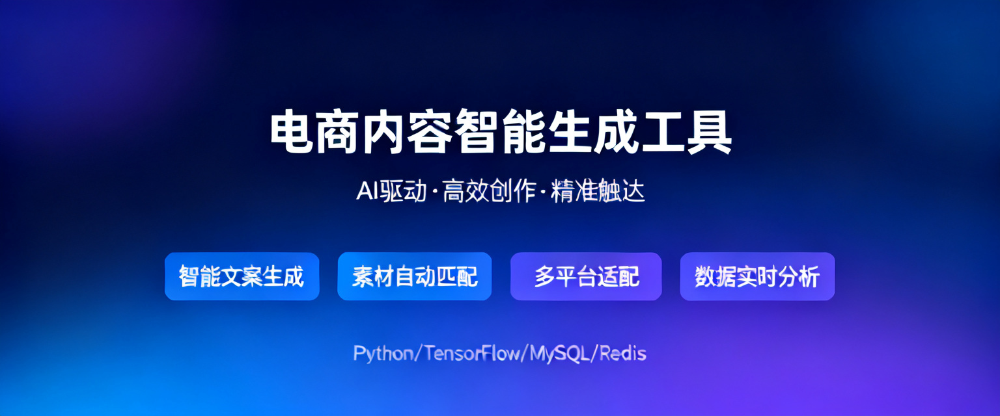

# 🎨 电商内容智能生成工具

<div align="center">
  
</div>

> 基于 Vibe Coding 理念，从零到一打造的电商运营效率工具

## 📖 项目介绍

这是一款面向电商运营团队的智能内容生成工具，旨在解决运营人员在商品上架时"白手起稿"的痛点。

**核心价值**：将繁琐的商品图文内容创作，转变为高效的"筛选+微调"工作流。

### 🎯 解决的问题

| 传统方式 | 工具赋能后 |
|---------|-----------|
| 每个商品从零撰写 | 批量生成图文草稿 |
| 手动编辑图片文案 | AI智能生成主图 |
| 反复修改调整 | 快速迭代优化 |

## ✨ 核心功能

### 🛍️ 商品任务

- 输入商品基础信息（名称、类目、品牌、材质等）
- AI智能生成标题和卖点文案
- 一键生成专业电商主图
- 支持提示词自定义和调整

### 📚 模板库

- 收藏优质图文模板
- 分类管理（主图模板、文案模板）
- 快速复用高效内容结构

### ⚙️ 设置中心

- 默认生成规则配置
- 图文风格偏好设置
- 功能开关管理

## 🚀 快速开始

### 环境要求

- Node.js 18+
- npm 或 yarn

### 安装部署

```bash
# 克隆项目
git clone <repository-url>
cd demo01

# 安装依赖
npm install

# 配置API密钥
cp .env.example .env
# 编辑 .env 文件，填入你的豆包API Key
VITE_DOUBAN_API_KEY=your_api_key_here

# 启动开发服务器
npm run dev
```

访问 <http://localhost:5173> 即可使用

### 构建生产版本

```bash
npm run build
```

构建产物在 `dist/` 目录

### 🚀 自动部署

项目配置了 GitHub Actions，自动部署到 GitHub Pages。

**部署步骤：**

1. 将项目推送到 GitHub 仓库
2. 在仓库 Settings → Pages → Source 中选择 "GitHub Actions"
3. 推送到 main 分支即可自动部署

**访问地址：**
```
https://你的用户名.github.io/vibe-commerce-generator/
```

> 首次部署需要手动配置 GitHub Pages source，后续推送 main 分支会自动部署

## 🛠️ 技术栈

<div align="center">

| 技术 | 说明 |
|------|------|
|  | 前端框架 |
|  | 类型安全 |
|  | 构建工具 |
|  | 样式方案 |
|  | 路由管理 |
|  | 图片生成 |

</div>

## 📁 项目结构

```
demo01/
├── docs/                    # 项目文档
│   ├── banner.svg          # 宣传封面图
│   ├── PRD.md             # 产品需求文档
│   └── plan.md            # 开发计划
├── public/                 # 静态资源
├── src/
│   ├── components/        # React组件
│   │   ├── Layout.tsx            # 布局组件
│   │   ├── ProductForm.tsx        # 商品表单
│   │   ├── ResultPreview.tsx      # 结果预览
│   │   └── ...
│   ├── pages/             # 页面组件
│   │   ├── HomePage.tsx          # 首页
│   │   ├── ProductTaskPage.tsx    # 商品任务页
│   │   ├── TemplatesPage.tsx     # 模板库页
│   │   └── SettingsPage.tsx       # 设置页
│   ├── hooks/             # 自定义Hook
│   ├── services/          # API服务
│   ├── utils/            # 工具函数
│   └── types/            # TypeScript类型
├── .env.example          # 环境变量示例
├── .gitignore            # Git忽略配置
└── package.json
```

## 💡 开发理念

### Vibe Coding 实践

本项目全程采用 Vibe Coding 理念开发：

```
需求分析 → AI辅助设计 → 迭代开发 → 持续优化
   ↓           ↓            ↓         ↓
  PRD文档   代码生成    功能实现    体验打磨
```

**核心工具链**：

- Claude Code：代码生成、调试优化
- GitHub Copilot：代码补全
- 豆包AI：图片生成

### 开发效率提升

| 传统开发 | Vibe Coding |
|---------|------------|
| 手动编写组件 | AI生成基础代码 |
| 逐一调试问题 | AI辅助快速定位 |
| 重复性工作多 | 模板化快速复用 |

## 📝 从这个项目学到的

### 产品能力

- 🎯 需求挖掘：从业务场景中发现真实痛点
- 📋 PRD撰写：清晰定义功能边界
- 🔄 迭代思维：MVP优先，快速验证

### 技术能力

- ⚛️ React生态：Hooks、Router、状态管理
- 🎨 UI设计：Tailwind CSS响应式布局
- 🔌 API集成：流式响应、SSE事件
- 🛡️ 工程规范：环境变量、安全配置

### 工程能力

- 📦 项目架构：组件化、模块化设计
- 🔧 开发流程：需求→设计→开发→测试
- 📚 文档规范：README、PRD、代码注释

## 🎓 个人成长

通过这个项目，我深刻理解了：

1. **AI辅助开发的边界**：AI擅长生成代码，但产品设计和架构决策仍需人来把控
2. **从0到1的完整流程**：不只是写代码，还包括需求分析、用户体验、技术选型
3. **快速迭代的重要性**：先做能用的，再做好用的

## 📄 License

MIT License

---

<div align="center">
  <p>Made with ❤️ and 🤖 by Vibe Coding</p>
  <p>让AI成为你的开发搭档，而不是替代者</p>
</div>
